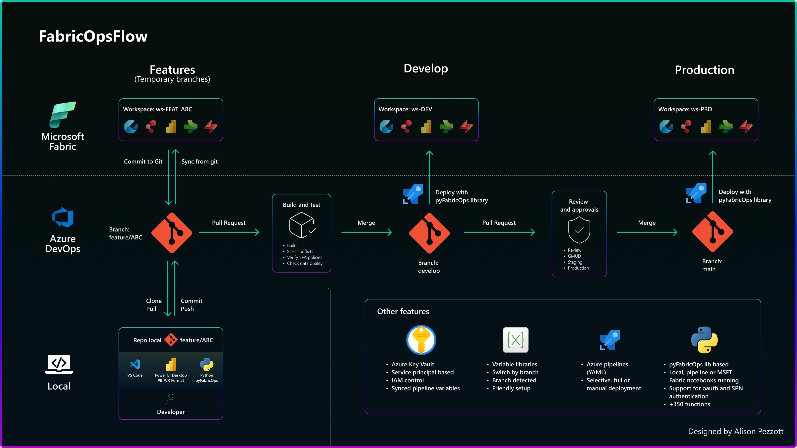

# FabricOpsFlow

A CI/CD framework for end-to-end automation of Microsoft Fabric projects, integrating Azure DevOps Pipelines, Service Principal authentication, and automated deployment powered by [pyFabricOps](https://pypi.org/project/pyfabricops/).

## What It Is

FabricOpsFlow automates the entire lifecycle of a Microsoft Fabric project — from infrastructure provisioning (workspaces, lakehouses, pools, environments) to continuous deployment of artifacts (notebooks, semantic models, reports, and more) via Azure DevOps Pipelines.

## Key Features

- **Full environment initialization**: An interactive Jupyter Notebook that provisions workspaces (DEV/PRD), lakehouses in a medallion architecture (bronze, silver, gold), Spark pools, environments with pre-installed libraries, Variable Libraries, and Azure DevOps Git integration — all via REST API.
- **Automated deployment with 3 modes**:
  - `selective` — deploys only changed items (based on `git diff`)
  - `specific` — deploys manually specified items
  - `full` — deploys all items in the repository
- **Automatic parameter switching between environments**: Replaces workspace IDs, lakehouse IDs, and connection strings in notebooks and semantic models when promoting from DEV to PRD.
- **Automatic report conversion**: Converts report definitions before deployment to ensure compatibility with the target workspace.
- **Secure authentication**: Credentials stored in Azure Key Vault and injected via Variable Groups in Azure DevOps.
- **Permission management**: Automatic role assignment (Admin/Owner) for users and service principals on workspaces and connections.

## Architecture

| Component | Description |
|---|---|
| `support/init_fabricopsflow.ipynb` | Initialization notebook that provisions all infrastructure |
| `azure_pipelines/deploy.yml` | Azure DevOps CI/CD pipeline |
| `scripts/deploy.py` | Deployment script that orchestrates publishing items to workspaces |
| `scripts/utils.py` | Git utilities for detecting changed items |
| `src/` | Directory with versioned Fabric artifacts (notebooks, semantic models, reports, etc.) |

## Workflow

1. **Developers** work in feature workspaces **FEAT**, connected to `feature/*` branches
2. **Pull requests**, once approved and merged into the `develop` branch, trigger deployment to the **DEV** workspaces
3. Once features reach a new deliverable, **pull requests** to the `main` branch trigger deployment to the **PRD** workspaces
4. The pipeline **detects changed items**, performs **parameter switching** between environments, and **deploys** to the corresponding workspace
5. **Reports** undergo definition conversion before deployment

## Prerequisites

- Microsoft Entra: App Registration with permissions for Power BI, Azure DevOps, and Key Vault
- Azure Key Vault with Service Principal credentials
- Azure DevOps: Organization, project, and repository configured
- Microsoft Fabric: API permissions enabled for the Service Principal security group

See the [initialization notebook](support/init_fabricopsflow.ipynb) for detailed instructions.

## Tech Stack

- **Microsoft Fabric** (Workspaces, Lakehouses, Notebooks, Semantic Models, Reports, Variable Libraries, Spark Pools & Environments)
- **Azure DevOps Pipelines** (CI/CD)
- **Azure Key Vault** (Secrets Management)
- **Microsoft Entra / Service Principal** (Authentication)
- **Python** + [pyFabricOps](https://pypi.org/project/pyfabricops/) (SDK)

## License

[MIT](LICENSE) © 2026 Alison Pezzott